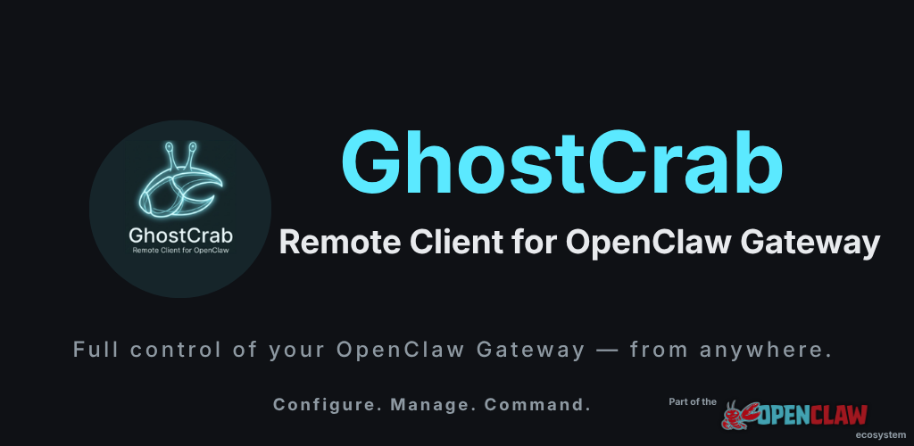

<p align="center">
  
</p>

<p align="center">
  <a href="https://github.com/thefixedpoint/GhostCrab/actions/workflows/ci.yml"></a>
  
  
  
</p>

**GhostCrab** is the Android companion to [OpenClaw Gateway](https://openclaw.io) — the open-source AI model serving platform. Point it at any reachable gateway on your LAN or over the internet and get full remote control from your phone.

It is not a consumer AI chat app. It is a configuration and administration client for people who run their own gateway.

---

## Features

- **Auto-discovery** — finds OpenClaw gateways on your local Wi-Fi via mDNS (no IP hunting required)
- **Manual connect** — enter any URL + optional bearer token for remote access
- **Config editor** — form-based editor for `openclaw.json` with typed fields, validation, and a diff-before-save sheet
- **Dashboard** — live gateway health, active model, version, and capability readout
- **Model manager** — view all configured models, swap the active one *(Phase 7, in progress)*
- **AI recommendations** — ask the gateway's built-in AI CLI for configuration suggestions *(Phase 8)*
- **Secure storage** — bearer tokens encrypted with AES-256-GCM via Android Keystore; never logged
- **Security banners** — explicit amber/crimson warnings for HTTP and no-auth connections; no silent risks
- **Onboarding walkthrough** — step-by-step guide to install, start, and connect to your first gateway

---

## Requirements

| | |
|---|---|
| Android | 8.0+ (API 26) |
| Gateway | OpenClaw Gateway — reachable from your device (LAN or URL) |

---

## Build

```bash
# Debug APK
./gradlew assembleDebug

# Install on connected device / emulator
./gradlew installDebug
```

---

## Release Build

```bash
# Signed release APK (requires local.properties with signing creds — see docs/RELEASE_SIGNING.md)
./gradlew :app:assembleRelease --no-configuration-cache

# Signed AAB for Play Store
./gradlew :app:bundleRelease --no-configuration-cache
```

See [`docs/RELEASE_SIGNING.md`](docs/RELEASE_SIGNING.md) for keystore location, CI wiring, and backup guidance.

---

## Development

```bash
# Unit tests
./gradlew testDebugUnitTest --no-configuration-cache

# Instrumented tests (requires connected device)
./gradlew connectedDebugAndroidTest

# Lint + static analysis
./gradlew lint detekt

# Single test class
./gradlew testDebugUnitTest --tests "com.openclaw.ghostcrab.data.GatewayConnectionManagerImplTest"
```

---

## Architecture

Single-activity Compose app. Strict layer separation — nothing skips a layer:

```
UI (Compose)  →  ViewModel (StateFlow)  →  Domain (interfaces)  →  Data (Ktor / NSD / DataStore)
```

| Layer | Key classes |
|-------|-------------|
| **UI** | `NavGraph`, screen composables, `GhostCrabTheme`, shared components (`GlassSurface`, `CodeBlock`, `SecurityBanner`) |
| **ViewModel** | One VM per screen, `StateFlow<UiState>`, `SharedFlow` for one-shot events |
| **Domain** | Frozen interfaces in `domain/repository/`, immutable models in `domain/model/`, sealed `GatewayException` hierarchy |
| **Data** | `OpenClawApiClient` (Ktor + OkHttp), `NsdDiscoveryServiceImpl`, `ConnectionProfileStore` (DataStore + EncryptedSharedPreferences), repository impls |
| **DI** | Koin — `AppModule`, `DataModule`, `DomainModule`, `UiModule` |

Domain interfaces are the v1.0 API surface and are **frozen** — implementations change, signatures don't.

---

## Privacy

- No analytics, no ads, no cloud backend
- Connection profiles stored locally via DataStore; bearer tokens stored in EncryptedSharedPreferences (AES-256-GCM, Android Keystore)
- Nothing is sent to the developer
- `Authorization` headers are stripped from all HTTP logs — verify with `adb logcat | grep -i bearer`

See [`docs/PRIVACY_POLICY.md`](docs/PRIVACY_POLICY.md) for the full policy.

---

## Implementation Status

| Phase | Feature | Status |
|-------|---------|--------|
| 0 | Scaffold, theme, DI skeleton | ✅ Done |
| 1 | Domain contracts | ✅ Done |
| 2 | Connection: Manual entry + auth probe | ✅ Done |
| 3 | Discovery: NsdManager + scan UI | ✅ Done |
| 4 | Dashboard, health polling, security banners | ✅ Done |
| 5 | Onboarding walkthrough | ✅ Done |
| 6 | Config editor (forms over `openclaw.json`) | ✅ Done |
| 7 | Model manager | ✅ Done |
| 8 | AI recommendations (gateway-proxied) | ✅ Done |
| 9 | Settings, profile management, about | ✅ Done |
| 10 | Hardening, release | ✅ Done |

---

## Contributing

Bug reports and pull requests are welcome. Please read `IMPLEMENTATION_PLAN.md` before starting significant work — it describes the phased build plan and frozen contracts.

---

## License

Apache 2.0 — see `LICENSE`.
